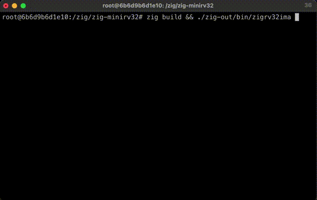

# zig-minirv32ima

Toby Jaffey https://mastodon.me.uk/@tobyjaffey

A pure zig port of https://github.com/cnlohr/mini-rv32ima

Blog posts documenting some of this:

 - https://www.ringtailsoftware.co.uk/zig-rv32/
 - https://www.ringtailsoftware.co.uk/zig-baremetal/

Tested with `zig 0.13.0`

# Build emulator

    zig build && ./zig-out/bin/zigrv32ima linux.bin

Type ctrl-`a` then `x` to exit.

# Samples

## `samples/hello`

Minimal "Hello world" in zig

    cd samples/hello
    zig build
    ../../zig-out/bin/zigrv32ima zig-out/bin/hello.bin

## `samples/shell`

Interactive shell (https://github.com/ringtailsoftware/zig-embshell/)

    cd samples/shell
    zig build
    ../../zig-out/bin/zigrv32ima zig-out/bin/shell.bin

## `samples/mandelbrot`

ASCII mandelbrot set

    cd samples/mandelbrot
    zig build
    ../../zig-out/bin/zigrv32ima zig-out/bin/mandelbrot.bin

# Notes

## Testing with qemu

    qemu-system-riscv32 -machine virt -nographic -bios foo.bin
    OR USE: zig build run

## Testing with qemu and gdb

    qemu-system-riscv32 -machine virt -nographic -s -S -bios foo.bin
    OR USE: zig build gdb
    then connect with for example: $ gdb-multiarch.exe foo.elf 

## Libc usage

libc is linked for access to the raw terminal. To remove, comment out `lib.linkSystemLibraryName("c");` in `build.zig`.
The `term` struct could be replaced by this minimal stub:

    const term = struct {
        pub fn init() void {
        }
        pub fn getch() ?u8 {
            return null;
        }
    };

VS Setup quirks using qemu and debug from:
https://www.youtube.com/watch?v=NbZDowmXzZs
https://github.com/chuckb/riscv-helloworld-c/tree/NbZDowmXzZs
